# DA-DETR: Depth Adaptive Detection Transformer

## Introduction

*Can depth information from stereo cameras improve the detection performance of a state-of-the-art object detector?*

Lately, depth aware convolution layers like the [ShapeConv](https://github.com/DepthAwareObjectDetection/ShapeConv)
and [Depth Adaptive CNN](https://github.com/DepthAwareObjectDetection/Depth-Adapted-CNN) have shown great promise in
improving performance on RGB-D datasets.
We research the impact of using these depth/ shape aware convolution layers (in place of vanilla convolutions) in
the [DeTR](https://github.com/DepthAwareObjectDetection/detr) object detector.

The rest of the blogpost is organised as follows: We start with introducing the topic and discussing its applications and relevance. Next we introduce ShapeConv and Depth Adaptive CNNs. 
Then we talk about the Detection Transformer, it's backbone and how we modify it to use depth convolution layers. 
Finally, we discuss results and progression of training over time.

## Why is this topic interesting and how is it relevant?
The object detection techniques were introduced in the early 2000s. Histogram of Oriented Gradients, known as HOG, has marked a start to the pedestrian detection problem that has evolved ever since. Nowadays, just roughly 20 years later, there exists many techniques to deal with pedestrian detection within the automotive industry. Even though HOG is still widely use for the detection task, the deep models started to gain attention. The most widely used methods are CNN, Region-based CNN, YOLO, Single Shot MultiBox Detector (SSD). However, running these models is rather computationally expensive.

Another interesting method to perform the detection in the automated driving scenario is incorporation of depth into the model. The available cars on the market are currently packed with numerous sensors for detecting objects in front of the vehicle. Among the common sensors are stereo cameras, radars and LiDARs. The depth information is available for the detection in the ADAS systems, however in most cases it is not fused with object detections. There are rather a couple of subsystems governing the detection. After individual detections are made by each subsystem, the results are often fused or combined in a higher-level decision-making process. This fusion step integrates the outputs from different sensors to provide a more comprehensive understanding of the surrounding environment and to make informed decisions for driving tasks.

Therefore, we embarked on testing the Detection Transformer (DeTR) in the automated driving setting. To achieve this we have converted and adapted the View of Delft dataset to be suitable for fine-tuning the model end-to-end. To incorporate the depth into predictions, we have created an instance of the original dataset that transforms the RGB into RGB-D images. We have then changed the backbone of the DETR to test, if the model with depth adapted backbone is suitable for pedestrian detection.

## DeTR

**DeTR** offers an object detection pipeline combining an **CNN** with a **Transformer** architecture.
The original model matches Faster R-CNN with a ResNet-50, obtaining 42 AP on COCO using half the computation power (
FLOPs) and the same number of parameters.

**What it is**. Unlike traditional computer vision techniques, DeTR approaches object detection has a direct set prediction problem. 
It consists of a set-based global loss, which forces unique predictions via bipartite matching, and a Transformer encoder-decoder architecture. 
Given a fixed small set of learned object queries, DeTR reasons about the relations of the objects and the global image 
context to directly output the final set of predictions in parallel. Due to this parallel nature, DeTR is very fast and efficient.

**The Backbone** of DETR consists of a CNN, typically ResNet. Its main goal is to extract features from input images. Additionally, the CNN performs dimensionality reduction, which reduces the complexity of the detection tasks handled by the Transformer. Another hidden benefit of using a CNN as a backbone is that it prepares the image by flattening it into the dimensions expected by the Transformer.

In the vanilla approach, we use the ResNet-50 architecture. Both the ResNet and the Transformer have been pre-trained on the COCO dataset. Subsequently, the model was fine-tuned on the View of Delft dataset.

*For details
see [End-to-End Object Detection with Transformers](https://ai.facebook.com/research/publications/end-to-end-object-detection-with-transformers)
by Nicolas Carion, Francisco Massa, Gabriel Synnaeve, Nicolas Usunier, Alexander Kirillov, and Sergey Zagoruyko.*

## ShapeConv

Shape-aware Convolutional layer (ShapeConv) processes depth information by decomposing it into different components.
Key points are as follows

- ShapeConv decomposes the input image into a shape component and a base component
- The shape components inform where the image is
- The base component informs what the image is
- ShapeConv leverages two trainable set of weights for each component as compared to one 'weight' for the vanilla convolutional layer
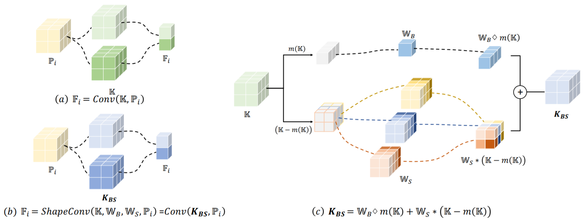
*A high level overview of ShapeConv*

## Depth Adaptive CNN
The Depth-Adaptive CNN is a slightly modified conventional Convolutional Neural Network. The architecture of the DACNN is adapted to handle the additional depth information alongside images. In this project we utilized the [Depth-Adapted CNN for RGB-D cameras](https://github.com/DepthAwareObjectDetection/Depth-Adapted-CNN) (further referred as Z-ACN).

Z-ACN enhances traditional CNN architectures by integrating depth information directly into the convolutional layers. Unlike conventional CNNs that use fixed grids, Z-ACN dynamically adjusts its convolutional grid based on the geometric properties derived from depth data. This adaptive grid, illustrated in Fig. 3, alters its receptive field according to object distances and projection effects, thereby improving the CNN's capability to handle 3D transformations effectively

The key concept involves modifying the convolutional layers of the network to incorporate an offset parameter alongside the image input. This offset dynamically adjusts the convolutional grid during operations (Fig. 3), aligning with the specific geometry and depth characteristics present in the input data.

Overall, Z-ACN aims to optimize performance without increasing network complexity or requiring larger datasets.

<!-- 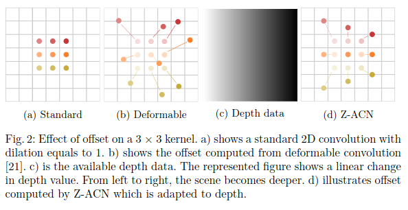

*Source: [Depth-Adapted CNN for RGB-D cameras](https://openaccess.thecvf.com/content/ACCV2020/papers/Wu_Depth-Adapted_CNN_for_RGB-D_cameras_ACCV_2020_paper.pdf)* -->

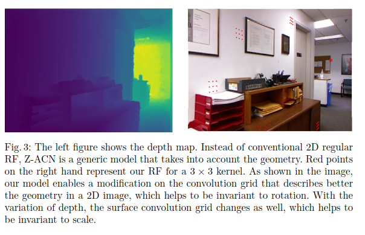

*Source: [Depth-Adapted CNN for RGB-D cameras](https://openaccess.thecvf.com/content/ACCV2020/papers/Wu_Depth-Adapted_CNN_for_RGB-D_cameras_ACCV_2020_paper.pdf)*

## View-of-Delft dataset
The View-of-Delft (VoD) dataset is a novel automotive dataset containing 8600 frames of synchronized and calibrated 64-layer LiDAR-, (stereo) camera-, and 3+1D radar-data acquired in complex, urban traffic. It consists of more than 123000 3D bounding box annotations, including more than 26000 pedestrian, 10000 cyclist and 26000 car labels.

## Changing the architecture
### Getting depth information for the RGB camera
The VOD dataset containes synchronised data acquired from cameras and a LiDAR. 
We get the depth information for the camera image by following these steps:

- We first transform the LiDAR point cloud to the camera's frame of reference.
- We then use the camera's projection matrix to get the location of these transformed point clouds in the image frame. This representation is quite sparse
- To get a more dense representation, we use the depth information of neighboring pixels and calculated a weighted average. 
- Link to the original repository: https://github.com/BerensRWU/DenseMap
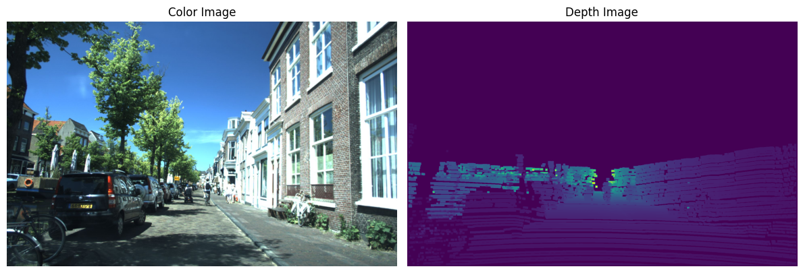

### Using 4d data in DETR
- The DeTR uses *torchvision.datasets.CocoDetection* class to get the dataset
- This class uses the PIL library to read RGB images
- We overode the *_load_image* class method to make it read numpy arrays (4-channel) and convert them to an object of PIL.Image

### Adapting DeTR to use ShapeConv Convolution layer
- PyTorch provides a modular implementation of the ResNet as part of its torchvision library
- We modified the existing ResNet class definition to replace the first convolution layer (kernel size = 7) with the ShapeConv convolution layer
- The authors of ShapeConv provide ShapeConv2D -> A torch.nn module that is a drop in replacement for the vanilla Conv2D module.
- This new class is called DepthResNet (DRN).
- We use the DepthResNet-18 (Depth equivalent of ResNet18) instead of DRN-50/ 100 used in the DeTR traditionally. This is done to make it trainable on a laptop GPU.

### Adapting DeTR to use Depth adaptive Convolution layer
We challenge the authors' claim that their depth-adaptable CNN approach is easy to implement. While this might hold true for developing a single network, integrating it into an existing pipeline presents significant challenges and errors.

During our attempt to adapt the ResNet18 architecture, we introduced the DeformConv2d layer, which requires two parameters: the input image and the offset. The offset was computed using the authors' proposed function. However, integrating DeformConv2d caused DeTR functions to fail initially when creating the backbone. This issue was resolved by incorporating the offset calculation within a custom layer. Nevertheless, this led to a substantial memory problem, with nearly 80 GB of GPU memory required for the offset calculation function.

We also experimented with various types of layers and attempted to incorporate depth processing in the forward pass of a custom layer. Despite trying many out-of-the-box approaches, the model failed to establish suitability for the given DeTR.

In addition, we examined and modified the preprocessing functions for DeTR models to handle the additional offset argument. However, this would necessitate further modifications to the Transformer component, which was beyond the scope of this research.

Due to these implementation challenges and given the time constraints of this research assignment, we abandoned the implementation of this depth-adaptable CNN.

#### Freezing the transformer
To adapt the model to only train the backbone and keep the transformer frozen we adapted the method showcased by the original project to freeze parts of the model.
This ensures only the changed backbone is trained, significantly reducing trainable parameters and allows easier validation of different models.
Since the transformer is frozen, no gradients have to be calculated for this part of the model, further increasing performance and reducing time required to train.

## Results

All results have been generated using the [finetune_detr](finetune_detr.ipynb) Jupiter notebook.
We have trained 3 models in total, fine-tuning of a pretrained original DeTR model, training the original DeTR model
from scratch and training the adapted model with ShapeConv from scratch.
The notebook explains all steps taken, creating a starting point model for the three scenarios, converting the VOD
dataset to the correct COCO format, training each model and evaluation of the trained models.
For further explanation of how things were done we would like to refer to the notebook.

### Fine tuning DeTR

To generate a baseline of the possible performance of DeTR on the View-of-Delft dataset we fine-tuned the original model
architecture using the pretrained [DeTR R50](https://dl.fbaipublicfiles.com/detr/detr-r50-e632da11.pth) model available
from the original repository.
The original `class_embed` weights and bias are removed from the model in order to re-train on the new VOD dataset.
We have fine-tuned the model for 40 epochs, after 10 epochs however little performance improvements could be noted.
Fine-tuning shows us that the original DeTR architecture is able to achieve an Average Precision with IoU>0.5 (mAP) of
0.7.
Increasing epochs past 10 shows an increase in loss, indicating overfitting on the dataset.
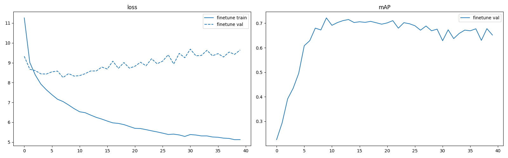
Using our finetuned model we further evaluated performance by visually inspecting predictions for images in the
validation and test set. This resulted in very impressive performance. Unfortunately the ground truth labels for the
test set are not publicly available, making it difficult to quantify the performance of the model. We provide the ground
truth labels for a random validation image:
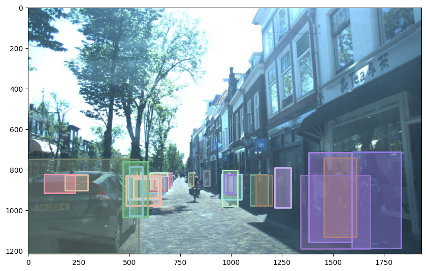

The next image shows the models prediction with a cutoff threshold of 0.9:
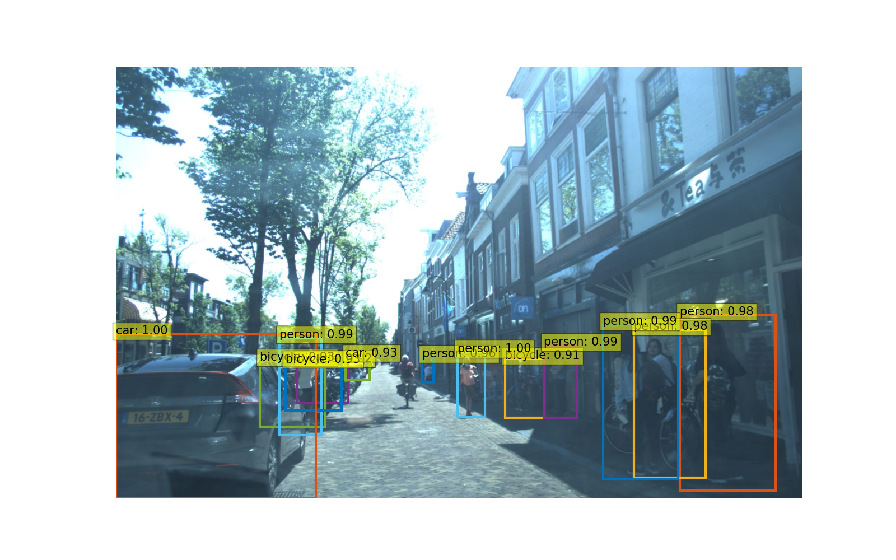

The following is the result of the model for a test images. The performance is impressive as the model is able to detect
most of the car parked along the road.
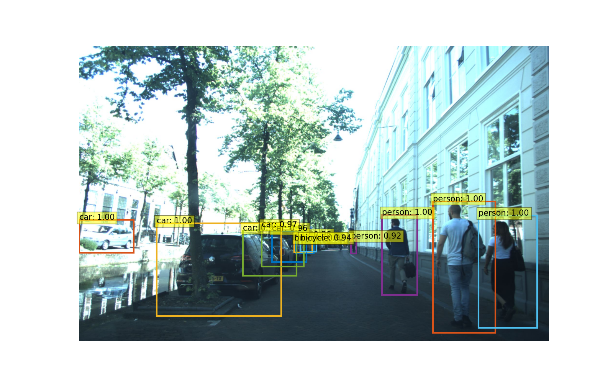

We also explored the inference time of the model to validate real-time capability. This results in very good performance
using an RTX 3080 GPU allowing the model to potentially be used in a real world scenario:

| Inference time | 0.0284 |
|:--------------:|--------|
|      FPS       | 35.2   |

### Training from scratch

Two models have been trained from scratch, the original DeTR framework using only the images, and the adapted DeTR using
the ConvNet CNN layers using images in combination with an additional depth channel. During training the transformer
part of the model has been frozen, and weights from a pretrained model have been used for this part to limit the amount
of trainable parameters. Both models have been trained for 70 epochs, requiring about 24 hours of training. It quickly
became clear the VOD dataset is too small to train the models from scratch, achieving very poor absolute performance.
Therefore, the obtained metrics should be used to compare the models in a proof-of-concept setting, evaluating if
additional depth information could potentially yield a higher performing model. Comparing both models with regard to the
loss and mAP we can see the original model trained from scratch (in blue) performs better than the adapted model using
ShapeConv. This unfortunately means the additional depth information seems to have little effect on the models'
performance. Performance of both models does seem to keep improving with additional epochs, however with a very slow
pace. Evaluating the models after more epochs could show different results, however this initial research shows
additional architectural changes should be made to better take advantage of the ShapeConv network.
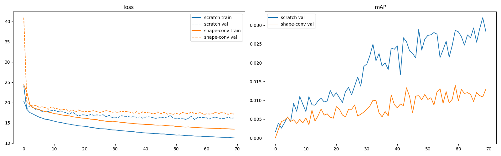

### Comparison

Comparing all three models, we notice a very low mAP score for the models trained from scratch in comparison to
fine-tuning. This is mainly caused by the high amount of trainable parameters, and the low amount of training samples
available in the VOD dataset. Comparing the class error of the models shows the ConvNet model struggling with correctly
classifying object classes. The
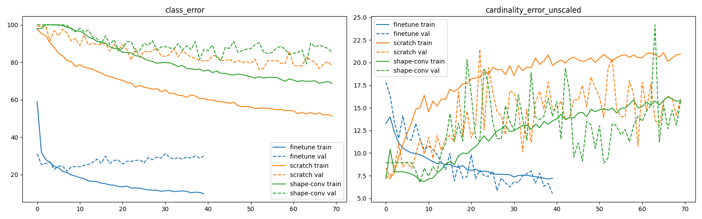

Comparing the losses of each model again shows us that the original model performs better with a lower loss.
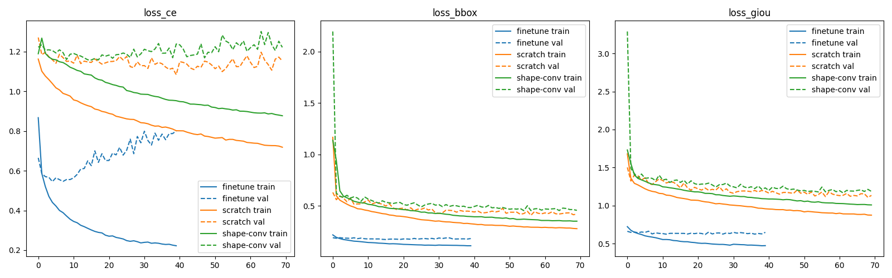

## Discussion

The result achieved show no improvement using the 3D dataset point in addition to the images to increase model
performance. A big challenge when training these models is to have enough data available, since there are a very high
amount of parameter (41 million) that need to be found. Since 3D depth information is required it greatly limits
datasets that can be used as fewer datasets are publicly available containing available this information. The
View-of-Delft dataset only contains 6000 train samples, which are also sequential making the dataset less worthy in
comparison to a dataset with independent samples. The DeTR model requires at least 10.000 sample to be properly trained,
making the VOD dataset too small. This explains why our models that have been trained from scratch are performing
poorly.

## Future improvements

The implementation of other CNN replacement frameworks taking depth information into account could be further explored.
Furthermore, larger datasets would be required to enable a better generalizing model using the depth information. The
LiDAR data does not contain depth information for each pixel, requiring data interpolation for intermediary pixels.
Preferably this new dataset would contain data from a stereo camera to have better depth information for each pixel,
without need to use the sparse LiDAR points. A larger dataset would also allow to train the entire model, including the
transformer, allowing for a more flexible framework to take advantage of the depth information to make predictions.

